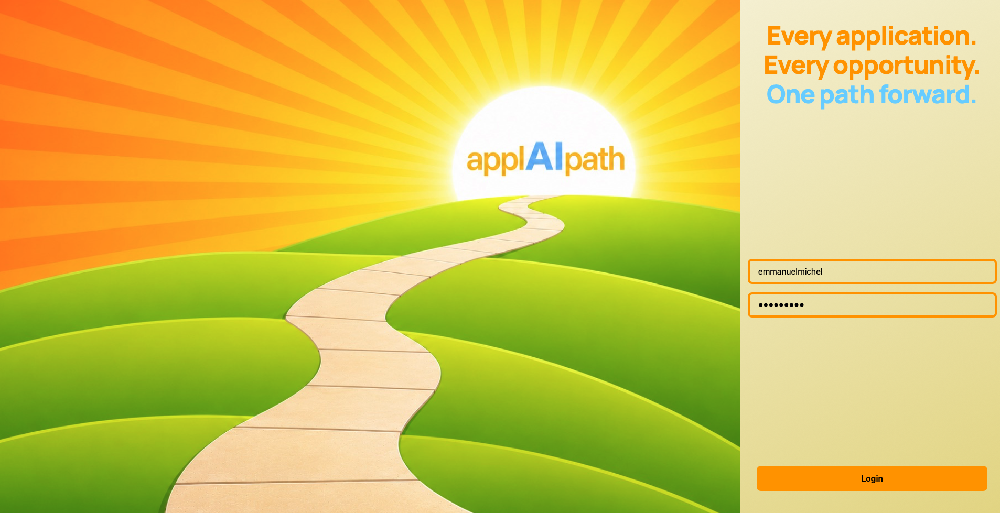
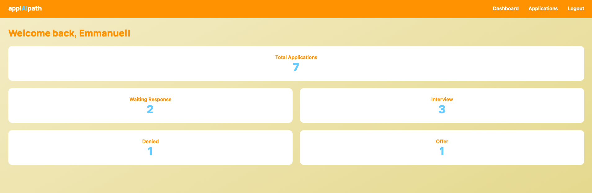
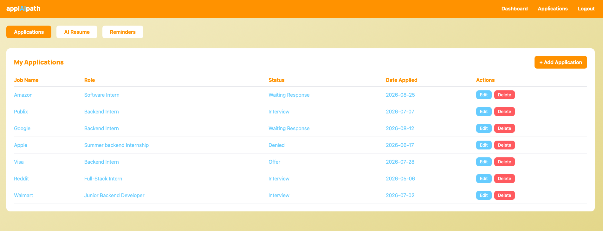
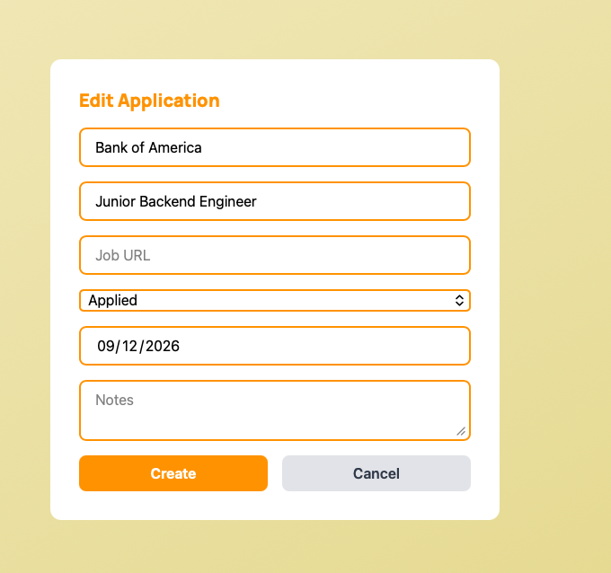
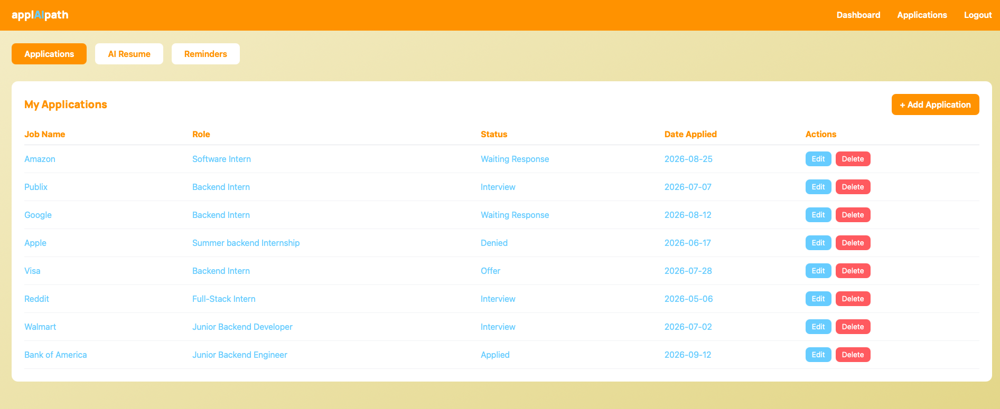
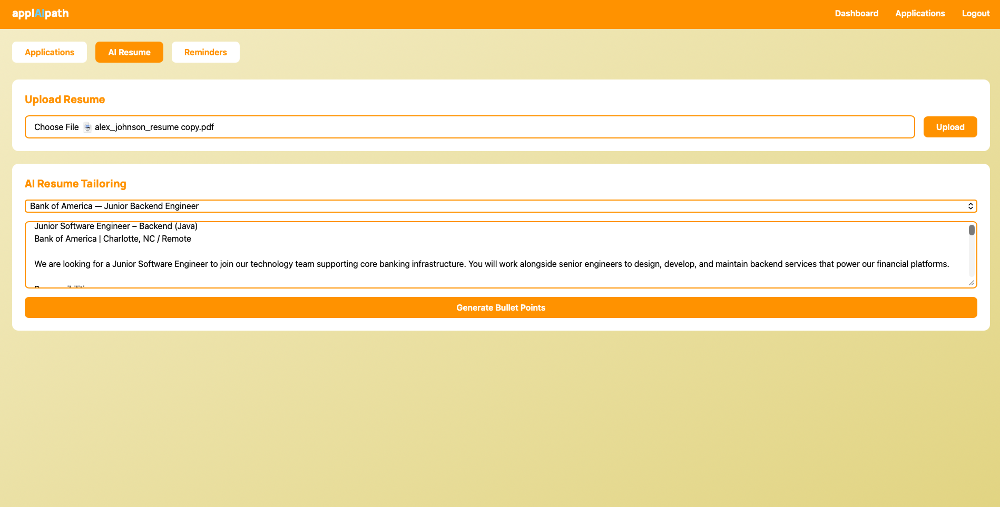
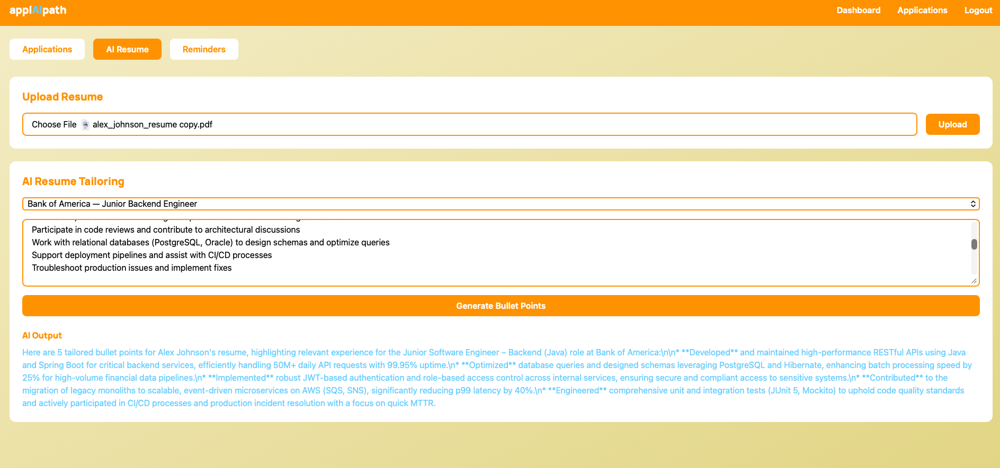
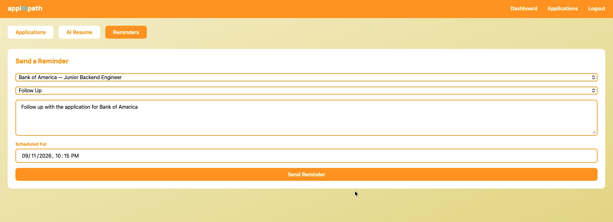
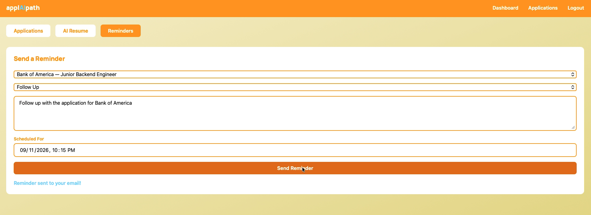
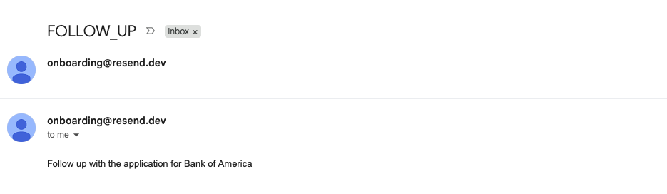

# Job Application Tracker

A full-stack job application tracking platform with AI-powered resume tailoring, scheduled email notifications, and a microservices backend.

**Live Demo:** [applaipath.vercel.app](https://applaipath.vercel.app)

---

## Features

- User authentication with JWT
- Track job applications with status updates (Applied, Waiting Response, Interview, Offer, Denied)
- Upload resumes and get AI-tailored versions based on job descriptions
- Schedule email reminders for follow-ups via Resend
- Dashboard with application statistics

---

## Tech Stack

### Frontend
- React + Vite
- Tailwind CSS
- Axios
- Deployed on **Vercel**

### Backend (Microservices)
| Service | Port | Responsibility |
|---|---|---|
| auth-service | 8081 | User registration, login, JWT |
| application-service | 8082 | CRUD for job applications |
| ai-service | 8083 | Resume upload + AI tailoring via PDF parsing |
| notification-service | 8084 | Scheduled email notifications |

- Java Spring Boot 4.0.6
- Spring Security + JWT (jjwt)
- Spring Data JPA
- PostgreSQL (Supabase)
- Resend Java SDK for transactional email
- Docker
- Deployed on **Render**

---

## Architecture

```
Frontend (Vercel)
      │
      ├──► auth-service        (JWT auth)
      ├──► application-service (job tracking)
      ├──► ai-service          (resume AI)
      └──► notification-service (email scheduler)
                │
         Supabase PostgreSQL
```

Each microservice has its own database schema and communicates with others via REST.

---

## Screenshots

### Landing Page


### Login


### Dashboard


### Applications


### Add Application


### Applications List (Updated)


### AI Resume Tailoring


### AI Output


### Set Reminder


### Reminder Confirmed


### Email Notification


---

## Author

Emmanuel Michel — [emmanuel.michel12@gmail.com](mailto:emmanuel.michel12@gmail.com)
